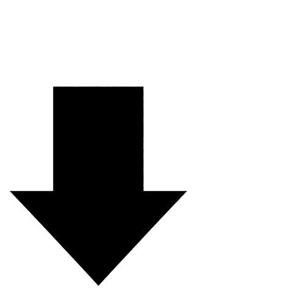

Подписаться: <a href="{{ site.vk }}">ВКонтакте</a>, <a href="{{ site.telegram }}">Telegram</a>

---

<table class="desktop" style="margin-bottom: 0; padding-bottom: 0">

<tr>
<td style="width: 30%">
<table><tr style="padding: 0; margin: 0;"><td style="width: 50%; padding: 0; margin: 0">

</td><td style="width: 50%; padding: 0; margin: 0; vertical-align: bottom">
начните здесь
</td></tr></table>
</td>
<td style="width: 30%"></td>
<td style="width: 30%"></td>
</tr>

</table>

<table class="desktop" style="padding-top: 0; margin-top: 0">

<tr>
<td style="width: 30%">

</td>
<td style="width: 30%">

</td>
<td style="width: 30%">

</td>
</tr>

<tr>
<td></td>
<td></td>
<td></td>
</tr>

<tr>
<td>

</td>
<td>

</td>
<td>

</td>
</tr>

<tr>
<td></td>
<td></td>
<td></td>
</tr>

<tr>
<td>

</td>
<td>

</td>
<td>

</td>
</tr>

<tr>
<td></td>
<td></td>
<td></td>
</tr>

<tr>
<td>

</td>
<td>

</td>
<td>

</td>
</tr>

<tr>
<td></td>
<td></td>
<td></td>
</tr>

<tr>
<td>

</td>
<td>

</td>
<td>

</td>
</tr>

<tr>
<td style="width: 30%"></td>
</tr>

<tr>
<td>

</td>
</tr>

</table>

начните здесь


 



 



 



 



 



 



 



 



 



 



 



 



 



 



 




---

Подписаться: <a href="{{ site.vk }}">ВКонтакте</a>, <a href="{{ site.telegram }}">Telegram</a>

---

### Рекомендуемые ресурсы

- [Голоса за животных](http://voicesforanimals.ru/) ([ВКонтакте](https://vk.com/voicesforanimals), [Telegram](https://t.me/voicesforanimals))
- Вегетарианцы и веганы ([ВКонтакте](https://vk.com/vegetarians), [Telegram](https://t.me/russian_vegans))
- [Едим лучше](https://vk.com/eatingbetter)
- [WhyAnimals](https://whyanimals.ru/)
- [Центр защиты прав животных "ВИТА"](http://www.vita.org.ru/) ([ВКонтакте](https://vk.com/club3349701), [Telegram](https://t.me/vita_russia))
- [Уменьшение страданий](https://reducingsuffering.github.io/) ([ВКонтакте](https://vk.com/reducing_suffering), [Telegram](https://t.me/reducing_suffering))
- [80000 часов. Как построить успешную карьеру и принести пользу миру](https://80000hours.ru/)
- [Animal Charity Evaluators](https://animalcharityevaluators.org/)
- [Anima International](https://animainternational.org/)
- Our World in Data: [Animal Welfare](https://ourworldindata.org/animal-welfare)
- [Reducetarian Foundation](https://www.reducetarian.org/)
- [One Step for Animals](https://www.onestepforanimals.org/)
